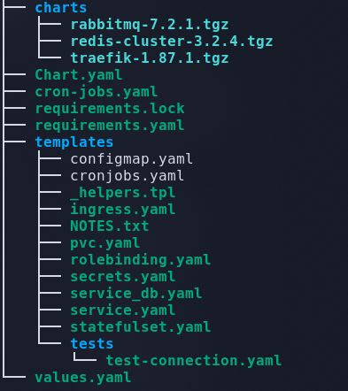

# K8s Kubernetes


## Setting up helm

[**Helm**](https://helm.sh/) is a package manager for kubernetes. Helm Charts help you define, install, and upgrade even the most complex Kubernetes application. helm v2 has a Client component - helm and the server side component  - tiller. 


### Install helm

Follow this guide to install helm on your local machine

https://v2.helm.sh/docs/using_helm/#installing-helm


### Initialize helm

Once helm (client side component) is installed, tiller needs to be installed on the Kubernetes cluster. A service Account with cluster wide permissions is required to use helm to deploy applications.

Create a file - `tiller_service_account.yaml` with the below content.

```yaml
apiVersion: v1
kind: ServiceAccount
metadata:
  name: tiller
  namespace: kube-system
---
apiVersion: rbac.authorization.k8s.io/v1
kind: ClusterRoleBinding
metadata:
  name: tiller
roleRef:
  apiGroup: rbac.authorization.k8s.io
  kind: ClusterRole
  name: cluster-admin
subjects:
  - kind: ServiceAccount
    name: tiller
    namespace: kube-system
```

then run 
```bash
kubectl apply -f tiller_service_account.yaml
```

Once the Service Account is created, initialize helm.

```bash
helm init --service-account tiller
```

```bash
helm init --service-account tiller
```

Confirm installation by checking the pods in the `kube-system` namespace

```bash
kubectl get pods --namespace kube-system
```

A successful helm initialization creates a pod with the name `tiller-deploy-xxxxxxx-xxxx` and it should be in running status.


## Note on Helm

Helm packages all the Kubernetes resources such as Statefulsets, deployments, secrets, pvcs etc into a single deployable unit known as a helm chart. helm also helps you install third party helm chats along with your own helm chart.

Below is the Directory structure of helm chart.




Manifests for all the resources are created in `templates` folder and the values for the keys are parametirized.


Example Manifest

```yaml
kind: PersistentVolumeClaim
apiVersion: v1
metadata:
  name: {{ .Release.Name }}-cache  
  labels:
    name: cache
spec:
  accessModes:
    - ReadWriteMany
  storageClassName: {{ .Values.project.persistence.storageClass | quote }}
  resources:
    requests:
      storage: {{ .Values.project.persistence.cache.size | default "10G" | quote }}
```

All the parameters for the manifests in `templates` are defined in `values.yaml`

The values specified in the `values.yaml` can be overridden with `--set <key>=<value>` during run time i.e., when running the helm install.


```bash
helm upgrade <RELEASE_NAME> . --install --namespace <namespace> 
        --set project.replicaCount=4
        --set project.image=nginx
```

To add any third party helm charts such as `traefik ingress controller` add the helm chart in `requirements.yaml` file and run 
`helm dependency update` 

The `requirements.yaml` looks similar to the below one

```yaml
dependencies:
- name: traefik
  version: '1.87.1'
  # This is the binaries repository, as documented in the GitHub repo
  repository: 'https://kubernetes-charts.storage.googleapis.com'

- name: rabbitmq
  version: '7.2.1'
  repository: 'https://charts.bitnami.com/bitnami'
```


## Troubleshooting Failed Deployments

If for any reason deployment fails, particularly when it says something like below

```
Error: UPGRADE FAILED: "mautic-dev" has no deployed releases
``` 

run

```bash
helm delete --purge <release_name>
kubectl delete <namespace>
```

If available run the cleanup job manually which basically does the same as above.

To find the release name and corresponding namespace, run

```bash
helm ls
```

You'd need helm installed on your machine.

For the DNS entries, the deploy stage itself gives instructions to find the ELB DNS Name:

1. Get the application URL by running these command:

```bash
kubectl get ingress mautic-mautic-composer-3-hello-ingress  --namespace mautic-composer-3 -o jsonpath='{.spec.rules[*].host}'

```

2. Get the ELB DNS record by running the below command:
```bash
kubectl get svc mautic-mautic-composer-3-traefik --namespace mautic-composer-3 -o jsonpath='{.status.loadBalancer.ingress[*].hostname}'
```

## Issues with helm --set

1. Commas must be escaped in deployment variables set in GitLab CI/CD Variables settings.

e.g. if you encounter something like 

```
helm Error: failed parsing --set data: key map "172" has no value
```

The error doesn't mention anything about the variable it effects, but you can guess this is an IP range, the first number after a comma.

We escape it:

``````